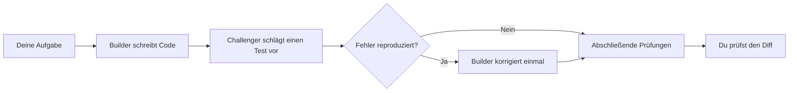

# Tarigato

[English](README.md) · [日本語](README.ja.md) · [简体中文](README.zh-CN.md) · **Deutsch**

Tarigato lässt zwei Coding-Agenten an einem Go-Projekt arbeiten. Einer ändert den Code. Der andere versucht, mit einem Test einen Fehler zu finden. Tarigato führt die Prüfungen aus, erlaubt höchstens eine Korrektur und speichert Patches, die du anschließend prüfen kannst.

**Experimentell.** Für Go-Projekte unter macOS und Linux.

[](docs/assets/terminal-demo.mp4)

*24 Sekunden Vorschau, aus der Terminalausgabe eines echten Durchlaufs gerendert und beschleunigt. Keine direkte Bildschirmaufnahme. [Video und Beispiel](docs/demo.md).*

## Installation

Du brauchst Go 1.27.1+, Git und Codex CLI oder Claude Code. Installiere das gewählte CLI, melde dich dort an und stelle sicher, dass es über deinen `PATH` erreichbar ist.

```sh
git clone https://github.com/tmls-ai/tarigato.git
cd tarigato
go build -o tarigato ./cmd/tarigato
export PATH="$PWD:$PATH"
```

Die letzte Zeile nimmt Tarigato für die aktuelle Terminalsitzung in deinen `PATH` auf.

## Verwendung

Starte Tarigato im Projekt, das du ändern möchtest:

```sh
cd /path/to/your-go-project
tarigato "Reject sessions when expiry is at or before now"
```

Das aktuelle Verzeichnis bestimmt das Git-Repository. Der Text in Anführungszeichen ist die Aufgabe. Das Repository muss einen Commit haben und darf keine uncommitteten Änderungen enthalten. Im Stammverzeichnis muss eine `go.mod` liegen, und mindestens ein benannter Test muss bestehen. Ohne Aufgabe zeigt `tarigato` die Hilfe an.

Standardmäßig verwenden beide Agenten Codex in getrennten Sitzungen. Du kannst den Anbieter für jede Rolle einzeln wählen:

```sh
tarigato --builder codex --challenger claude "Fix the session expiry boundary"
```

Optionen stehen vor der Aufgabe. `--timeout 30m` begrenzt die gesamte Laufzeit; der Standard sind 30 Minuten. `--help` zeigt die Optionen. `NO_COLOR=1` schaltet die Terminalfarben aus.

## Ablauf

| Rolle | Aufgabe |
|---|---|
| Agent 1: Builder | Ändert Go-Produktivcode, ohne bestehende Tests zu verändern. |
| Agent 2: Challenger | Reicht einen Test für einen möglichen Fehler ein oder meldet, dass kein Fehler gefunden wurde. |



Die Agenten arbeiten nacheinander. Bestehende Tests müssen vor und nach der Änderung des Builders bestehen. Tarigato führt den eingereichten Test zweimal in frischen Arbeitsverzeichnissen aus. Schlägt eine Assertion wiederholt fehl und bestehen die ursprünglichen Tests weiterhin, ist eine Korrektur erlaubt. Bei ungültigen oder uneinheitlichen Challenger-Ergebnissen stoppt der Durchlauf zur Prüfung.

Die Steuerung führt die Prüfungen aus; die Agenten entscheiden nicht selbst, ob ihre Arbeit besteht. Alle Regeln stehen im [Design-Dokument](docs/design.md).

## Beispiel: Abgelaufene Sitzungen

Eine Sitzungsprüfung verwendet `expiresAt >= now`. Ihre Tests prüfen Zeitstempel in der Vergangenheit und Zukunft, aber nicht den genauen Ablaufzeitpunkt.

Die Aufgabe: Sitzungen ab ihrem Ablaufzeitpunkt ablehnen.

```diff
- return expiresAt >= now
+ return expiresAt > now
```

Der Challenger kann `Valid(100, 100)` testen und `false` erwarten. Im [aufgezeichneten Beispiel](docs/demo.md) nahm der Builder diese Änderung vor, und der Test des Challengers bestand. Eine Korrektur war nicht nötig.

[Probiere das Beispiel aus](docs/demo.md): ein kleines Repository mit diesem Fehler und einer bestehenden Testsuite, deren Tests alle bestehen.

## Ergebnisse

Durchläufe werden unter `~/.tarigato/runs/<id>/` gespeichert. Ein erfolgreicher Durchlauf enthält:

| Datei | Inhalt |
|---|---|
| `changes.patch` | Abschließende Änderungen am Quellcode. |
| `tests.patch` | Der akzeptierte Test des Challengers oder ein leerer Patch, falls keiner eingereicht wurde. |
| `report.md` | Ergebnisse und Befehle zum Wiederholen der Prüfungen. |
| `result.json` | Testergebnisse, Werkzeugversionen und Hashes der Artefakte. |

Tarigato verwendet separate Arbeitsverzeichnisse. Es wendet keine Patches auf deinen Checkout an und führt weder Merge noch Push aus.

`ready_for_review` bedeutet, dass die abschließenden Prüfungen bestanden wurden. Prüfe den Diff und den Erwartungswert des Tests selbst. Auch wenn ein Test besteht oder kein Fehler gefunden wird, ist damit nicht bewiesen, dass der Code korrekt ist.

## Grenzen

- Der Builder darf nur `.go`-Dateien mit Produktivcode außerhalb von `testdata`, `vendor` und `.github` ändern. Bestehende Tests, Abhängigkeiten und Konfiguration sind geschützt.
- Symlinks, Submodule, Git-Attribute/LFS-Konfiguration und Go-Workspaces werden nicht unterstützt. Siehe [Anforderungen an das Repository](docs/design.md#workspaces-and-tests).
- Verwende vertrauenswürdige Projekte. Agenten und generierte Tests werden lokal ausgeführt; separate Arbeitsverzeichnisse sind keine Sandboxes. Siehe [Sicherheit](SECURITY.md).
- Codex hat einen Smoke-Test unter macOS bestanden. Für Claude gibt es Adaptertests, aber noch keinen Test mit einem echten Durchlauf. Windows wird nicht unterstützt.

[Design](docs/design.md) · [Mitwirken](CONTRIBUTING.md) · [Sicherheit](SECURITY.md)

Die README ist in vier Sprachen verfügbar. Terminalausgabe und ausführliche Dokumentation sind derzeit auf Englisch.

Entwickelt von [TMLS.NYC](https://tmls.nyc). Die Lizenz steht noch nicht fest.
