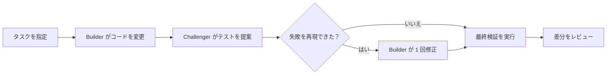

# Tarigato

[ウェブサイト](https://tarigato.vercel.app)

[English](README.md) · **日本語** · [简体中文](README.zh-CN.md) · [Deutsch](README.de.md)

Tarigato は Go プロジェクト向けの CLI ツールです。2 つのエージェントが、コードの変更とバグを探すテストの作成を分担します。検証は Tarigato が実行します。実装後の追加の修正は最大 1 回で、結果をレビュー用のパッチとして保存します。

**実験段階です。** macOS と Linux 上の Go プロジェクトに対応しています。

[](docs/assets/terminal-demo.mp4)

*実際の実行結果をもとに描画し、早送りした 24 秒のプレビューです。画面を直接録画したものではありません。[動画と実行例](docs/demo.md)。*

## インストール

Go 1.27.1 以降、Git、認証済みの Codex CLI または Claude Code が必要です。いずれも `PATH` から実行できるようにしてください。

```sh
git clone https://github.com/tmls-ai/tarigato.git
cd tarigato
go build -o tarigato ./cmd/tarigato
export PATH="$PWD:$PATH"
```

最後の行で、現在のターミナルセッションの `PATH` に Tarigato を追加します。

## 使い方

変更したいプロジェクトのディレクトリで実行します。

```sh
cd /path/to/your-go-project
tarigato "Reject sessions when expiry is at or before now"
```

カレントディレクトリから対象の Git リポジトリを選びます。引用符内のテキストがタスクです。リポジトリにはコミットが必要で、未コミットの変更があってはいけません。また、ルートに `go.mod` があり、名前の付いたテストが少なくとも 1 件成功する必要があります。タスクを指定せずに `tarigato` を実行すると、ヘルプを表示します。

デフォルトでは、両方のエージェントが別々の Codex セッションを使います。役割ごとに Codex または Claude を選べます。

```sh
tarigato --builder codex --challenger claude "Fix the session expiry boundary"
```

オプションはタスクより前に指定してください。`--timeout 30m` は実行全体の制限時間を設定します。デフォルトは 30 分です。`--help` でオプション一覧を表示し、`NO_COLOR=1` でターミナルの色を無効にできます。

## 仕組み

| 役割 | 作業 |
|---|---|
| エージェント 1：Builder | 既存のテストを変更せずに、Go の実装コードを変更する。 |
| エージェント 2：Challenger | バグの可能性を検証するテストを 1 つ提出するか、問題が見つからなかったと報告する。 |



エージェントは順番に実行されます。Builder の変更前と変更後に、既存のテストがすべて成功する必要があります。提出されたテストは 2 回実行し、そのつど新しい作業領域を用意します。既存のテストが成功したままアサーションの失敗を再現できた場合に限り、1 回の追加修正を認めます。提出内容が無効だったり、結果が一致しなかったりした場合は、処理を止めてレビューに回します。

検証を実行するのはコントローラーです。エージェント自身が合否を決めることはありません。詳しいルールは[設計ドキュメント](docs/design.md)を参照してください。

## 例：セッションの有効期限

セッションの有効性を `expiresAt >= now` で判定するコードがあります。テストは過去と未来の時刻を確認していますが、有効期限ちょうどの時刻を確認していません。

タスクは、有効期限に達したセッションを無効にすることです。

```diff
- return expiresAt >= now
+ return expiresAt > now
```

Challenger は `Valid(100, 100)` の戻り値が `false` になることをテストできます。[記録した実行例](docs/demo.md)では、Builder がこの変更を行い、Challenger のテストは成功しました。追加の修正は不要でした。

このバグと、すべて成功するテストを含む小さなリポジトリで、[実行例を試せます](docs/demo.md)。

## 実行結果

実行結果は `~/.tarigato/runs/<id>/` に保存されます。正常に完了した実行には、次のファイルが含まれます。

| ファイル | 内容 |
|---|---|
| `changes.patch` | 最終的なソースコードの変更。 |
| `tests.patch` | 受け入れられた Challenger のテスト。提出がなければ空のパッチ。 |
| `report.md` | 結果と、検証を再実行するためのコマンド。 |
| `result.json` | テストの観測結果、ツールのバージョン、生成物のハッシュ。 |

Tarigato は別の作業領域を使います。手元のチェックアウトにパッチを適用したり、マージやプッシュを行ったりすることはありません。

`ready_for_review` は、最終検証が成功したことを示します。差分とテストの期待値は、自分で確認してください。テストの成功や「問題が見つからなかった」という報告は、コードの正しさを証明するものではありません。

## 制限

- Builder が変更できるのは、`testdata`、`vendor`、`.github` の外にある実装コードの `.go` ファイルだけです。既存のテスト、依存関係、設定は保護されます。
- シンボリックリンク、サブモジュール、Git attributes / LFS の設定、Go ワークスペースには対応していません。[リポジトリの要件](docs/design.md#workspaces-and-tests)を参照してください。
- 信頼できるプロジェクトで使ってください。エージェントと生成されたテストはローカルで動きます。作業領域を分けても、サンドボックスにはなりません。[セキュリティ](SECURITY.md)を参照してください。
- Codex は macOS で基本的な動作を確認済みです。Claude はアダプターのテストのみで、実際の CLI を使った動作は未確認です。Windows には対応していません。

[設計](docs/design.md) · [コントリビューション](CONTRIBUTING.md) · [セキュリティ](SECURITY.md)

README は 4 言語で読めます。ターミナルの出力と詳細ドキュメントは、現在英語のみです。

開発：[TMLS.NYC](https://tmls.nyc)。ライセンスはまだ決まっていません。
