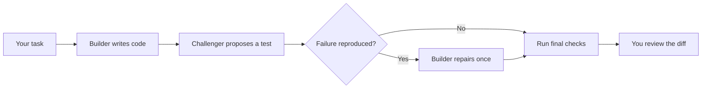

# Tarigato

**One builds. One challenges. Tests settle the challenge.**

A small Go tool by **[TMLS.NYC](https://tmls.nyc)** that puts two coding agents on one task with opposing objectives. The builder writes the code. The challenger tries to expose a mistake. Tarigato runs the tests, allows one repair, and gives you the diff.

> **Experimental.** Go repositories only. Review every result before applying it. Codex has passed a macOS smoke test; Claude has not been tested live.

[](docs/assets/terminal-demo.mp4)

*Rendered from actual CLI output; playback accelerated. Not a screen recording.*

[Watch the video](docs/assets/terminal-demo.mp4) · [Run the example](docs/demo.md)

## The game



- **Builder:** satisfy the task without changing the existing tests.
- **Challenger:** find one concrete counterexample, expressed as a new test.
- **Referee:** Go code runs the checks; neither agent decides whether it passed.
- **You:** decide whether the test is right and whether to accept the code.

One challenge round. One repair at most. Invalid tests and unfinished runs stay visible.

## Use it

Build from source with Go 1.27.1 or newer and Git installed:

```sh
git clone https://github.com/tmls-ai/tarigato.git
cd tarigato
go build -o tarigato ./cmd/tarigato
```

Put the binary on your `PATH`. Install and authenticate the coding CLI you want to use, then run Tarigato inside a clean, committed repository with a root `go.mod` and at least one passing named test:

```sh
tarigato "Reject sessions when expiry is at or before now"
```

Choose the agents when needed:

```sh
tarigato --builder codex --challenger claude "Fix the session expiry boundary"
```

The default is two separate Codex sessions. Use `--builder` and `--challenger` to choose `codex` or `claude`. `--timeout 30m` sets the total deadline; `--version` prints the binary version. Options come before the task. Tests run with `go test -json -count=1 ./...`; no configuration file is needed.

The terminal shows each move and its elapsed time. Piped output stays plain; set `NO_COLOR=1` to disable terminal styling.

Tarigato runs in separate workspaces and writes patches, test evidence, and a report under `~/.tarigato/runs/<id>/` for you to review and apply. It does not merge or push changes.

## A boundary your tests missed

Your session check uses `expiresAt >= now`. Tests cover yesterday and tomorrow, but miss the exact expiry time: the session stays valid one instant too long.

Give Tarigato the rule: **“Reject sessions when expiry is at or before now.”** The builder changes the implementation; a separate challenger tries to expose a mistake with an executable test. You get the source diff, the admitted test, and the recorded results to review.

The [runnable session expiry example](docs/demo.md) starts with that bug and a passing test suite.

## Scope

- One task, two agent roles, one new test file, at most one repair.
- Only production `.go` files outside `testdata`, `vendor`, and `.github` may change. Existing tests, dependencies, and configuration are protected.
- Symlinks, submodules, Git attributes/LFS configuration, and Go workspaces are unsupported. See the [exact repository limits](docs/design.md#workspaces-and-tests).
- Trusted local projects only. Generated code and tests execute with your user permissions; workspaces are not sandboxes.
- Process control targets macOS and Linux. Windows is unsupported.
- Controller tests use fake agents and need no model credentials. They do not establish real-provider compatibility.

[Design and diagrams](docs/design.md) · [Contributing](CONTRIBUTING.md) · [Security](SECURITY.md)

## Project

Built by **TMLS.NYC**. English first; translations follow demand. License selection is pending before the public release.
