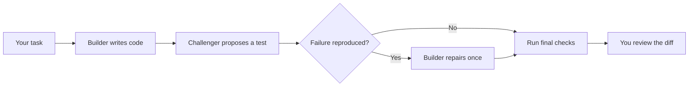

# Tarigato

**English** · [日本語](README.ja.md) · [简体中文](README.zh-CN.md) · [Deutsch](README.de.md)

Tarigato runs two coding agents on a Go project. One changes the code. The other tries to find a bug with a test. Tarigato runs the checks, allows at most one repair, and saves patches for you to review.

**Experimental.** For Go projects on macOS and Linux.

[](docs/assets/terminal-demo.mp4)

*24-second preview rendered from a real run and sped up. Not a raw screen recording. [Video and example](docs/demo.md).*

## Install

You need Go 1.27.1+, Git, and an authenticated Codex CLI or Claude Code on your `PATH`.

```sh
git clone https://github.com/tmls-ai/tarigato.git
cd tarigato
go build -o tarigato ./cmd/tarigato
export PATH="$PWD:$PATH"
```

The last line adds Tarigato to your `PATH` for this terminal session.

## Usage

Run it inside the project you want to change:

```sh
cd /path/to/your-go-project
tarigato "Reject sessions when expiry is at or before now"
```

The current directory selects the Git repository. The quoted text is the task. The repository must be clean and committed, with a root `go.mod` and at least one passing named test. Running `tarigato` without a task prints help.

Both agents use Codex by default, in separate sessions. You can choose a provider for each role:

```sh
tarigato --builder codex --challenger claude "Fix the session expiry boundary"
```

Put options before the task. `--timeout 30m` sets the total deadline; 30 minutes is the default. `--help` lists the options. `NO_COLOR=1` turns off terminal colors.

## How it works

| Role | Job |
|---|---|
| Agent 1: Builder | Change production Go code without changing existing tests. |
| Agent 2: Challenger | Submit one test for a possible bug, or report no finding. |



The agents run in order. Existing tests must pass before and after the builder's change. Tarigato runs the submitted test twice in fresh workspaces. A repeated assertion failure, with the original tests still passing, allows one repair. Invalid or inconsistent challenges stop for review.

The controller runs the checks; the agents do not decide whether their work passes. See the [design](docs/design.md) for the full rules.

## Example: session expiry

A session check uses `expiresAt >= now`. Its tests cover past and future timestamps but miss the exact expiry time.

The task is to reject sessions at or after expiry:

```diff
- return expiresAt >= now
+ return expiresAt > now
```

The challenger can test `Valid(100, 100)` and expect `false`. In the [recorded example](docs/demo.md), the builder made this change and the challenger's test passed. No repair was needed.

[Run the example](docs/demo.md) in a small repository with that bug and a passing test suite.

## Results

Runs are saved under `~/.tarigato/runs/<id>/`. A successful run includes:

| File | Contents |
|---|---|
| `changes.patch` | Final source changes. |
| `tests.patch` | The accepted challenge test, or an empty patch if none was submitted. |
| `report.md` | Results and commands to replay the checks. |
| `result.json` | Test observations, tool versions, and artifact hashes. |

Tarigato uses separate workspaces. It does not apply patches to your checkout, merge, or push.

`ready_for_review` means the final checks passed. Review the diff and the test's expectation yourself. A passing test or no finding does not prove the code is correct.

## Limits

- Builder changes are limited to production `.go` files outside `testdata`, `vendor`, and `.github`. Existing tests, dependencies, and configuration are protected.
- Symlinks, submodules, Git attributes/LFS configuration, and Go workspaces are unsupported. See the [repository requirements](docs/design.md#workspaces-and-tests).
- Use trusted projects. Agents and generated tests run locally; separate workspaces are not sandboxes. See [Security](SECURITY.md).
- Codex has passed a macOS smoke test. Claude has adapter tests but has not been tested live. Windows is unsupported.

[Design](docs/design.md) · [Contributing](CONTRIBUTING.md) · [Security](SECURITY.md)

The README is available in four languages. Terminal output and detailed documentation are currently in English.

Copyright (C) 2026 [TMLS.NYC](https://tmls.nyc) and contributors.

Tarigato is licensed under the [GNU Affero General Public License v3.0](LICENSE), version 3 only (`AGPL-3.0-only`).
