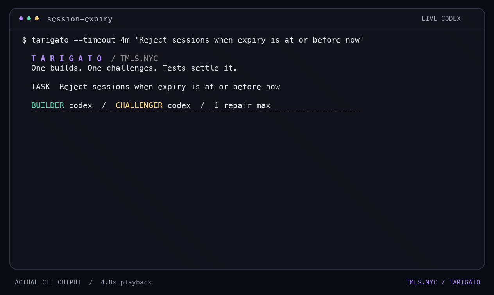
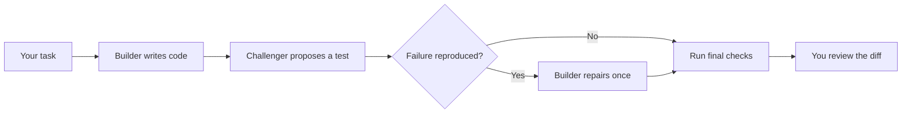

# Tarigato

**One builds. One challenges. You review the evidence.**

Tarigato gives two coding agents different jobs on the same task: implement the change, then try to expose a mistake. A small Go controller runs the tests, allows one repair after a reproduced failure, and saves the patches and results for you to inspect.

One task. Two roles. One challenge round.

[Get started](#get-started) · [How it works](#how-it-works) · [Try the example](docs/demo.md) · [Design](docs/design.md)

[](docs/assets/terminal-demo.mp4)

*24-second preview rendered from a real CLI run. Playback is accelerated; this is not a raw screen recording. [Watch the video](docs/assets/terminal-demo.mp4).*

## Get started

You need **Go 1.27.1+**, **Git**, and an installed, authenticated **Codex CLI** or **Claude Code** on your `PATH`. Tarigato targets macOS and Linux.

Build from source:

```sh
git clone https://github.com/tmls-ai/tarigato.git
cd tarigato
go build -o tarigato ./cmd/tarigato
export PATH="$PWD:$PATH"
```

The last line makes `tarigato` available in the current terminal. Next, enter the **Go project you want to change** and describe the behavior you want:

```sh
cd /path/to/your-go-project
tarigato "Reject sessions when expiry is at or before now"
```

**Your directory selects the project. Your quoted text defines the task.** Tarigato uses the enclosing Git repository, which must be clean and committed, with a root `go.mod` and at least one passing named test.

For a small project you can try immediately, follow the [session expiry example](docs/demo.md).

## How it works

| Agent | Job |
|---|---|
| **1 · Builder** | Implement your task in production Go code, leaving existing tests unchanged. |
| **2 · Challenger** | Look for a counterexample and submit one Go test, or report no finding. |

The agents run in order, in separate sessions. The Go controller checks their work and records the outcome. You decide whether the requirement, test, and resulting code are right.



Baseline tests run before the builder starts. The original tests must still pass before the challenger gets a turn. A submitted challenge runs twice in fresh workspaces; only a reproduced assertion failure permits a repair. Invalid or inconsistent challenges stop for review.

Both roles use **Codex** by default. Choose each role's provider when needed:

```sh
tarigato --builder codex --challenger claude "Fix the session expiry boundary"
```

Options come before the task. `--timeout 30m` sets the total deadline; 30 minutes is the default. Use `--help` for options and `--version` for the installed version. No configuration file is needed.

The terminal shows each stage and its elapsed time. Piped output stays plain; `NO_COLOR=1` disables styling.

## A boundary your tests missed

Your session check accepts `expiresAt >= now`. Tests cover timestamps before and after expiry, but miss equality. At the exact expiry time, the session still gets through.

Give Tarigato the rule: **“Reject sessions when expiry is at or before now.”**

The intended change is small:

```diff
- return expiresAt >= now
+ return expiresAt > now
```

A useful challenge checks `Valid(100, 100)` and expects `false`. That turns the requirement into something executable. In the [recorded example](docs/demo.md), the builder made the change, the challenger submitted a test, and the checks passed without a repair.

## Leave with evidence

Each run saves its artifacts under `~/.tarigato/runs/<id>/`. A successful run leaves:

| File | What to review |
|---|---|
| `changes.patch` | The final production-code changes. |
| `tests.patch` | The admitted challenge test; empty when none was submitted. |
| `report.md` | The outcome and commands to replay the checks. |
| `result.json` | Recorded test observations, versions, and artifact hashes. |

Tarigato works in separate workspaces and leaves the source checkout unchanged. It does not apply, merge, or push the patches.

**`ready_for_review` means the final checks passed.** It does not prove complete coverage. Read the test's expectation and the source diff before accepting the change.

## Scope

Tarigato is **experimental** and focused on changes to existing Go projects.

- Builder changes are limited to production `.go` files outside `testdata`, `vendor`, and `.github`. Existing tests, dependencies, and configuration stay protected.
- Symlinks, submodules, Git attributes/LFS configuration, Go workspaces, and Windows are unsupported. See the [repository requirements](docs/design.md#workspaces-and-tests).
- Use trusted projects. Agents and generated tests execute locally; separate workspaces are not sandboxes. See [Security](SECURITY.md).
- Codex has passed a macOS smoke test. Claude has adapter tests but has not been tested live. Controller tests use fake agents and require no model credentials.

[Design and diagrams](docs/design.md) · [Contributing](CONTRIBUTING.md) · [Security](SECURITY.md)

---

Built by **[TMLS.NYC](https://tmls.nyc)**. English first; translations follow demand. License selection is pending before public release.
