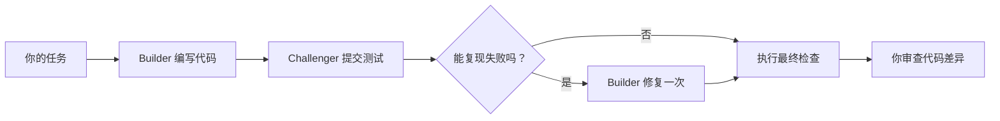

# Tarigato

[English](README.md) · [日本語](README.ja.md) · **简体中文** · [Deutsch](README.de.md)

Tarigato 让两个编程智能体处理同一个 Go 项目。一个修改代码，另一个编写测试，尝试找出缺陷。Tarigato 负责执行检查，最多允许追加修复一次，并保存补丁，供你审查。

**实验阶段。** 适用于 macOS 和 Linux 上的 Go 项目。

[](docs/assets/terminal-demo.mp4)

*这段 24 秒的预览由一次真实运行的输出渲染并加速生成，并非原始屏幕录像。[视频和示例](docs/demo.md)。*

## 安装

需要 Go 1.27.1+、Git，以及已完成身份验证且位于 `PATH` 中的 Codex CLI 或 Claude Code。

```sh
git clone https://github.com/tmls-ai/tarigato.git
cd tarigato
go build -o tarigato ./cmd/tarigato
export PATH="$PWD:$PATH"
```

最后一行将 Tarigato 加入当前终端会话的 `PATH`。

## 使用

在你想修改的项目中运行：

```sh
cd /path/to/your-go-project
tarigato "Reject sessions when expiry is at or before now"
```

当前目录决定使用哪个 Git 仓库，引号中的文字就是任务。仓库必须已有提交且没有未提交的改动，根目录中必须有 `go.mod`，并且至少有一个有名称且能通过的测试。不提供任务直接运行 `tarigato` 会显示帮助。

两个智能体默认都使用 Codex，各自在独立会话中运行。你可以分别选择工具：

```sh
tarigato --builder codex --challenger claude "Fix the session expiry boundary"
```

选项需放在任务之前。`--timeout 30m` 设置整次运行的时限，默认是 30 分钟。`--help` 列出所有选项。`NO_COLOR=1` 关闭终端颜色。

## 工作方式

| 角色 | 职责 |
|---|---|
| 智能体 1：Builder（实现） | 修改非测试 Go 代码，不改动现有测试。 |
| 智能体 2：Challenger（查错） | 针对可能的缺陷提交一个测试，或报告未发现问题。 |



两个智能体依次运行。Builder 修改代码前后，现有测试都必须通过。Tarigato 会在全新的工作目录中将提交的测试运行两次。只有两次都出现断言失败，且原有测试仍然通过时，才允许修复一次。测试不符合要求或两次结果不一致时，流程会停止，等待审查。

检查由控制程序执行，是否通过不由智能体自行判断。完整规则见[设计文档](docs/design.md)。

## 示例：会话过期

一个会话检查使用 `expiresAt >= now`。现有测试覆盖了过期时间早于和晚于当前时间的情况，却漏掉了两者相等的边界。

任务是让会话在到达过期时间及之后失效：

```diff
- return expiresAt >= now
+ return expiresAt > now
```

Challenger 可以测试 `Valid(100, 100)`，预期结果为 `false`。在[演示中的实际运行](docs/demo.md)里，Builder 做出了上述修改，Challenger 提交的测试也通过了，因此无需追加修复。

你可以在一个包含此缺陷、现有测试均能通过的小型仓库中[运行示例](docs/demo.md)。

## 运行结果

每次运行的结果保存在 `~/.tarigato/runs/<id>/`。成功运行后会生成：

| 文件 | 内容 |
|---|---|
| `changes.patch` | 最终的源代码改动。 |
| `tests.patch` | 被接受的挑战测试；未提交测试时为空补丁。 |
| `report.md` | 运行结果及重新执行检查的命令。 |
| `result.json` | 测试运行记录、工具版本和产物哈希值。 |

Tarigato 使用独立的工作目录，不会把补丁应用到你的本地检出目录，也不会合并或推送。

`ready_for_review` 表示最终检查已通过。你仍需自行审查代码差异和测试的预期结果。测试通过或未发现问题，并不能证明代码正确。

## 限制

- Builder 只能修改 `testdata`、`vendor` 和 `.github` 之外的非测试 `.go` 文件。现有测试、依赖和配置均受保护。
- 不支持符号链接、子模块、Git attributes/LFS 配置和 Go 工作区。详见[仓库要求](docs/design.md#workspaces-and-tests)。
- 只在可信项目中使用。智能体和生成的测试均在本地运行，独立工作目录并不是沙箱。详见[安全说明](SECURITY.md)。
- Codex 已通过 macOS 冒烟测试。Claude 的适配器有测试覆盖，但尚未进行实际运行验证。不支持 Windows。

[设计文档](docs/design.md) · [贡献指南](CONTRIBUTING.md) · [安全说明](SECURITY.md)

README 提供四种语言版本。终端输出和详细文档目前为英文。

由 [TMLS.NYC](https://tmls.nyc) 开发。尚未选定许可证。
