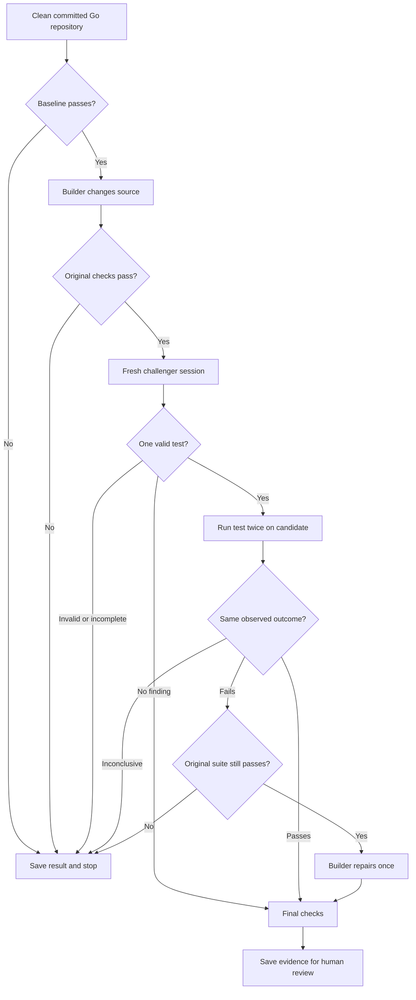
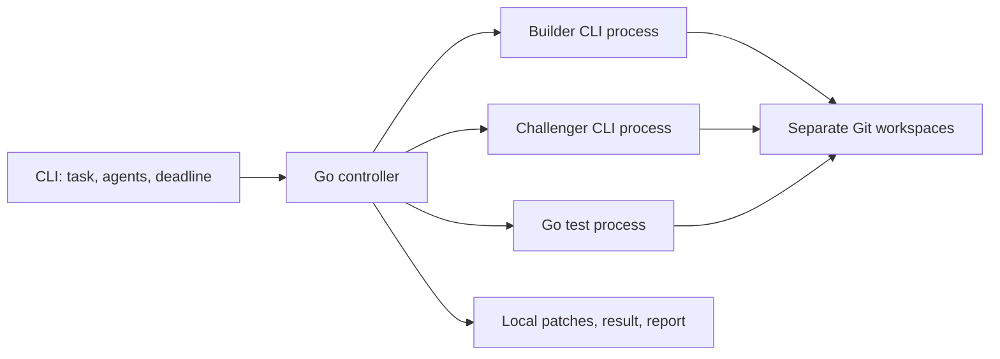

# Tarigato design

**TMLS.NYC · experimental Go implementation**

One foreground command runs a small adversarial game: a builder satisfies a task, a challenger looks for a counterexample, and a Go controller checks the result. Two agent roles; no judge agent.

## Game rules

| Role | Objective | Allowed move |
|---|---|---|
| Builder | Make the requested behavior work | Change production code; repair once after a reproduced challenge |
| Challenger | Expose a requirement the patch violates | Submit one new Go test file with one named test, or report no finding |
| Controller | Enforce the rules and record observations | Run checks, preserve evidence, bound execution, and report outcomes |
| Human | Decide what should ship | Review the requirement, test, and final diff |

Opposing objectives and fixed rules are the game-theory mechanism. There are no scores, learned rewards, or claims of an optimal strategy. A critique must become an executable test to count as a challenge. A failing test establishes an observation; you decide whether its expectation is correct.

## The loop



The baseline, candidate, challenge, and final checks are separate observations. Missing or skipped tests, inconsistent outcomes, compilation errors, and crashed agents cannot become successful findings. An invalid challenge stops the run without a repair.

A passing challenge is retained for final checks. A reproduced failure permits one repair with the challenge test frozen. The final result still requires the original checks and admitted test to pass. A second repair is never attempted.

## Architecture



One controller owns the sequence and run directory. Agent output proposes changes; it does not choose the final status. Go's standard library handles command-line parsing, processes, JSON, filesystem operations, and hashes. Git and Go are external tools. There is no background service, database, or configuration file.

## Command

```sh
tarigato [--builder codex|claude] [--challenger codex|claude] [--timeout 30m] "task"
```

Options precede the task. Defaults are separate Codex sessions and a 30-minute total deadline. The deadline bounds execution; it is not a money cap. Commands have an 8 MiB output limit. Checks use `go test -json -count=1 ./...`. Go may fetch project dependencies according to the local environment. `tarigato --version` prints the binary version.

Provider adapters are experimental; see the recorded smoke-test coverage below. Controller tests substitute fake agents and require no provider credentials. Codex runs with `--sandbox workspace-write`; Claude runs with `--permission-mode default`. Both receive a temporary Go build cache. Provider command failures stop as `blocked`; malformed structured responses stop as `error`.

## Workspaces and tests

The source repository must be clean and committed, including no untracked files except those ignored by Git. It needs a root `go.mod`, a passing baseline, and at least one passing named test. Symlinks and submodules are rejected, as are root-level `.gitattributes`, `.lfsconfig`, and `go.work` files.

Ignored files from your original checkout are not copied into the run. Tarigato runs in separate workspaces and captures patches for you to apply: the candidate before the challenge, and final source after any repair. It checks whether the original checkout changed during a completed run; this does not provide filesystem isolation.

The builder may change only regular production `.go` files outside `testdata`, `vendor`, and `.github`. Existing tests and every other file are protected. The challenger may add one `tarigato_challenge_test.go` file with one named test and local helpers. Test admission rejects unsupported changes and test-runner hooks. The controller compares workspace hashes and records artifact hashes and parses Go test events to confirm that the expected test actually executed. Check-time changes to workspace files, including generated ignored files, invalidate the observation.

Go 1.27.1 or newer is required. Its structured test output distinguishes assertion failures from ordinary log messages. Panics, missing tests, and unsupported diagnostics remain inconclusive.

The controller reruns the challenge and checks the combined suite. It does not establish complete test coverage or prove correctness. Workspaces and agent permission settings are not an operating-system sandbox; use trusted projects. See [Security](../SECURITY.md).

## Results

Each run lives under `~/.tarigato/runs/<id>/`. The terminal prints the result and its location. A completed run contains:

```text
candidate.patch    base -> source challenged
changes.patch      base -> final source
tests.patch        admitted challenge test
result.json        task, identities, observations, and final status
report.md          review and replay instructions
logs/*.jsonl       bounded test diagnostics
```

Candidate and final source patches are alternatives. Replay the original failure from the recorded base plus `candidate.patch` and `tests.patch`. Replay the final checks from a fresh base plus `changes.patch` and `tests.patch`. Stopped runs may have only the artifacts produced before stopping.

Unsuccessful runs retain any created workspaces under `workspaces/` for inspection. These contain unvalidated changes. Successful runs remove their workspaces and retain the report, patches, and diagnostics.

| Status | Meaning | Exit |
|---|---|---:|
| `ready_for_review` | Challenge completed and final checks passed | 0 |
| `needs_review` | A code/test failure or invalid/inconclusive challenge remains | 1 |
| `blocked` | Prerequisite, provider command failure, or execution limit prevents completion | 2 |
| `error` | Controller failure or malformed structured response | 3 |
| `interrupted` | User cancelled the run | 130 |

No finding means no additional defect was demonstrated. `ready_for_review` is a check result, not permission to merge. Review the test's expectation and final diff yourself.

## Validation and release

Run `go test -race ./...`, `go vet ./...`, and `go build ./cmd/tarigato`. Deterministic tests exercise the game with fake agents and temporary repositories. Real-provider runs are separate qualification and must name the CLI version and host actually tested.

On 2026-10-01, Codex CLI 0.159.2 with Go 1.27.1 on macOS arm64 completed a synthetic expiry-boundary task as `ready_for_review`: source edit, submitted challenge, two passing challenge runs, and passing final checks. No repair was needed in that live run; deterministic tests cover the repair path. Claude has adapter tests but has not been tested live. This is smoke coverage, not a general reliability claim.

Tarigato is licensed under [AGPL-3.0-only](../LICENSE). Before a supported release, broaden provider coverage and verify the README from a clean checkout. See [Security](../SECURITY.md) for private vulnerability reporting. The README is available in English, Japanese, Simplified Chinese, and German; terminal output and detailed documentation remain in English. Add runners or platforms when a real use case requires them.
